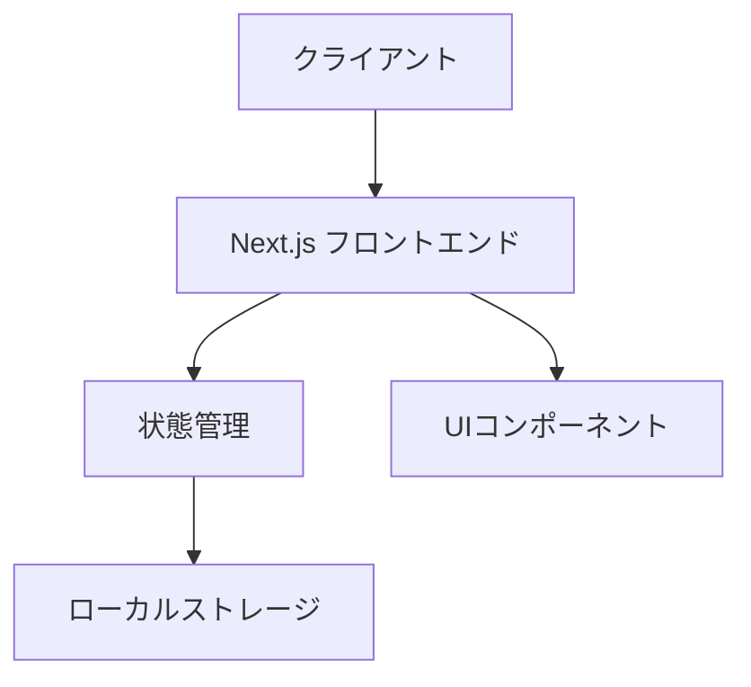
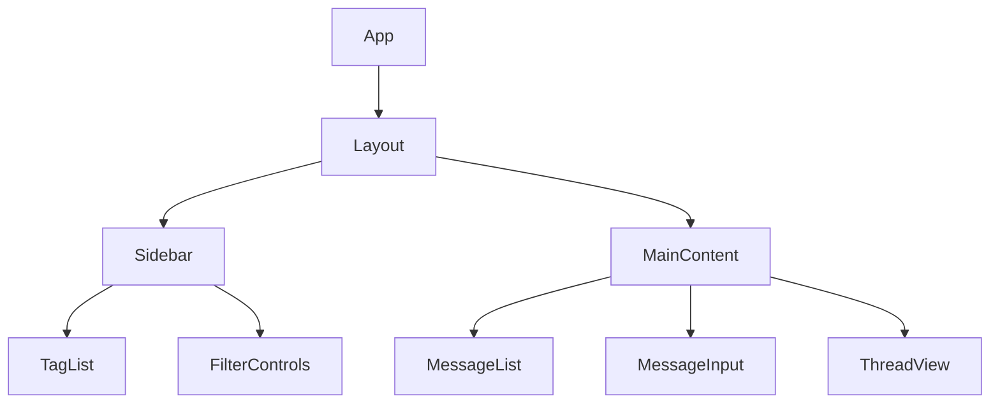
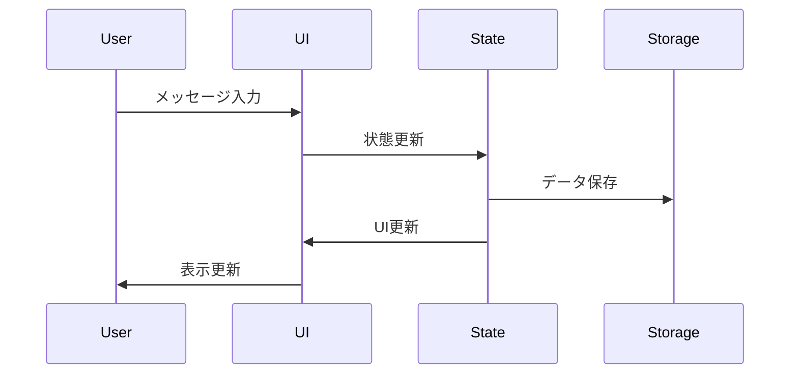

# IO - システムパターン

## システムアーキテクチャ

IOアプリケーションは、以下のシンプルなアーキテクチャに基づいて構築されます：

### アーキテクチャの特徴

- **クライアントサイド中心** - デモ段階ではサーバーサイド実装を含まない
- **コンポーネントベース** - Reactの特性を活かしたコンポーネント設計
- **ローカルストレージ** - データの永続化はクライアントサイドのみ（デモ段階）

## 主要な技術的決定

1. **Next.js採用の理由**
   - Reactベースのフレームワークとしての安定性
   - 将来的なSSRやAPIルート実装の可能性
   - ビルド最適化とパフォーマンス向上

2. **状態管理アプローチ**
   - React標準の状態管理機能を活用（useState, useContext等）
   - シンプルな状態管理を優先
   - 必要に応じて段階的に拡張

3. **UIコンポーネント設計**
   - 機能ベースのシンプルなコンポーネント構成
   - 再利用性と保守性を考慮
   - Tailwindを活用した効率的なスタイリング

4. **データ構造**
   - メッセージ、スレッド、タグの基本的な関係モデル
   - 検索とフィルタリングに対応したシンプルな設計

## 基本コンポーネント構成

## データフロー

## 技術スタック

- **フレームワーク**: Next.js
- **UIライブラリ**: React
- **スタイリング**: Tailwind CSS
- **状態管理**: React標準機能（useState, useContext）
- **データ保存**: LocalStorage

## Tailwind CSSの活用

- **ユーティリティファースト** - 事前定義されたユーティリティクラスを活用した効率的なスタイリング
- **カスタマイズ性** - プロジェクト固有のデザインシステムに合わせたカスタマイズ
- **一貫性** - デザインの一貫性を保ちながら迅速な開発を実現
- **レスポンシブデザイン** - 組み込みのレスポンシブユーティリティによる効率的なモバイル対応

## 将来的な拡張性

現在のシンプルなアーキテクチャは、以下の将来的な拡張を考慮しています：

1. **コンポーネント設計の洗練**
   - 必要に応じて適切な設計パターンを導入
   - コンポーネントの再利用性向上

2. **状態管理の拡張**
   - アプリケーションの複雑さに応じて適切な状態管理ライブラリの検討
   - パフォーマンス最適化

3. **バックエンド統合**
   - APIルートを通じたサーバーサイド機能の追加
   - データベース永続化への移行パス

4. **認証システム**
   - ユーザー認証の追加による個人データの保護
   - マルチデバイス同期の基盤

5. **AI機能**
   - タグ自動提案
   - 関連メモの推薦
   - 要約機能
